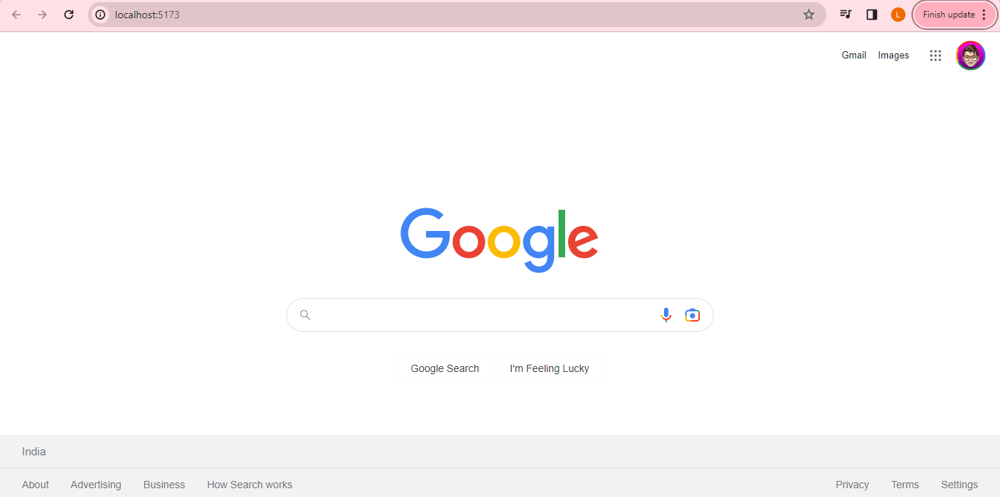
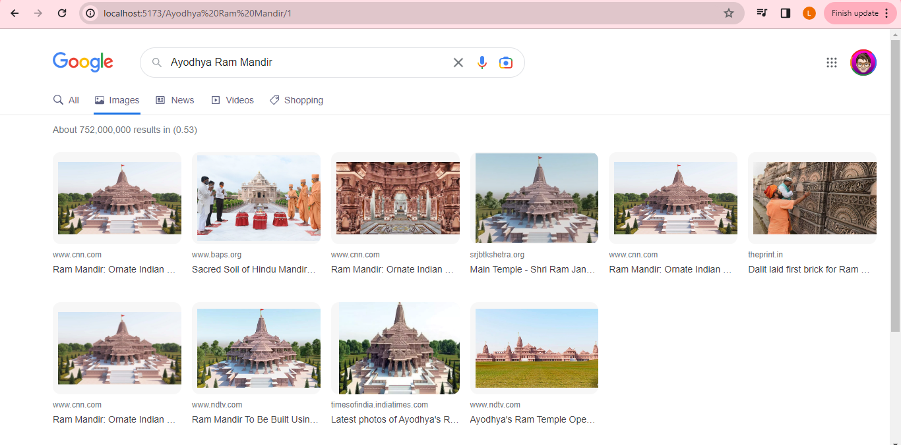

# Welcome to React Google Clone!

## A Google Clone

# Technologies 👇

## React 🔥

## Context Api 🔥

## React Router Dom 🔥

## Tailwind CSS🔥

## Google Search API

## Demo 🔥

<a href="https://g-clone-app.netlify.app/" target="_blank">Live Demo</a>

## Available Scripts 🔥

In the project directory, you can run:

### `Clone the repo`

### `npm install`

### `npm run dev`

## Preview Home Page

## Preview Search Page

